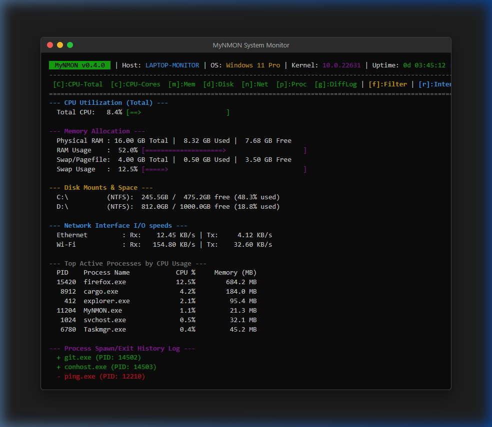

# MyNMON

[日本語 (Japanese)](README_JA.md)




A lightweight, cross-platform CLI system monitor inspired by the classic `nmon` utility, written in Rust. It utilizes `sysinfo` for retrieving system metrics and `crossterm` for rendering a terminal-based user interface.

## Features

- **Multi-section display**: Toggle sections dynamically. CPU total and individual cores can be toggled separately.
- **Initial Welcome Help Screen**: Displays usage commands and keyboard shortcut help centered on the screen when all sections are hidden at startup.
- **CPU Utilization**: Monitor total CPU usage and individual CPU cores with visual ASCII progress bars.
- **Memory Allocation**: Real-time statistics on physical RAM and swap memory (total, used, and free).
- **Disk Mounts & Space**: Monitor disk mount points, filesystems, and available space.
- **Network Interface I/O**: Track Rx/Tx speeds in KB/s sorted alphabetically by interface name with stable text alignment.
- **Top Active Processes**: Monitor active processes sorted by CPU usage. PID and process names are properly formatted and aligned.
- **Process Search/Filter**: Real-time filtering of the process list by name, showing the active match counts.
- **Process Change Log**: Real-time spawn/exit history logs (+ for spawn, - for exit) showing recent process differences.
- **Dynamic Refresh Interval**: Change screen refresh intervals (seconds) interactively by pressing `r` and entering a number while running.
- **Screen Protection (Size Check)**: Automatically skips rendering and displays a warning message if the terminal size is smaller than the minimum requirement (80x20).
- **Double Launch Prevention**: Named Mutex protection on Windows to prevent screen rendering conflicts.
- **Interactive Control**: Toggle components immediately using simple keyboard shortcuts.
- **Highly Optimized**: Extremely small binary footprint (~324 KB) and low memory usage (~21.3 MB).

## Keyboard Shortcuts

Press these keys while the application is running to toggle sections or quit:

- `C` : Toggle Total CPU utilization section
- `c` : Toggle CPU Core utilization section
- `m` : Toggle Memory allocation section
- `d` : Toggle Disk mounts & space section
- `n` : Toggle Network interface speed section
- `p` or `t` : Toggle Top processes section
- `g` or `l` : Toggle Process spawn/exit history log section
- `f` : Start process search/filter mode (Press `Enter` or `Esc` to apply/exit search mode)
- `r` : Set screen refresh interval in seconds (Enter/Esc to save/cancel)
- `q` or `Esc` : Quit the application (when not in input mode)

## Command-Line Options

You can run `MyNMON` with the following command-line flags:

- `-h`, `--help` : Print the help message containing command usage and options, then exit.
- `-v`, `--version` : Print the dynamically resolved application version (from `Cargo.toml`), then exit.

Example usage:
```bash
./MyNMON --help
./MyNMON --version
```

## Getting Started

### Prerequisites

1. Ensure you have Rust and Cargo installed. (Rust 1.96.0 or higher is recommended)
2. This project depends on a shared library `common_lib` via a relative path (`../common_lib`). You need to clone both repositories in the same parent directory:

```bash
# Clone the shared library
git clone https://github.com/tkshnkgwr/common_lib.git

# Clone the main project (MyNMON)
git clone https://github.com/tkshnkgwr/MyNMON.git
```

Your directory structure should look like this:
```text
parent_directory/
├── common_lib/
└── MyNMON/
```

### Build and Run

Clone this repository and run the following command in the project directory:

```bash
cargo run --release
```

The compiled binary will be available at `target/release/MyNMON` (or `target/release/MyNMON.exe` on Windows).

### Cargo Features (Custom Build)

You can use Cargo Features to build lightweight binaries with only specific monitoring components:

- **Full Build (Default)**:
  ```bash
  cargo build --release
  ```
- **Minimal Build (CPU & Memory only, ~324 KB)**:
  ```bash
  cargo build --release --no-default-features --features "cpu,mem"
  ```


## Directory Structure

```text
.
├── Cargo.toml            # Project configuration and dependency settings
├── LICENSE               # MIT License
├── README.md             # Project overview (English)
├── README_JA.md          # Project overview (Japanese)
├── src/
│   ├── main.rs           # Entry point and main event loop control
│   ├── state.rs          # Application state definition (MonitorState)
│   ├── ui.rs             # UI and section rendering logic
│   └── utils.rs          # Time formatting, padding, and ASCII bar utilities
└── docs/
    ├── ja/               # Japanese Documentation
    │   ├── SPEC.md
    │   ├── ARCHITECTURE.md
    │   ├── DIAGRAM.md
    │   ├── FOOTPRINTS.md
    │   ├── TODO.md
    │   └── TEST_REPORT.md
    └── en/               # English Documentation
        ├── SPEC.md
        ├── ARCHITECTURE.md
        ├── DIAGRAM.md
        ├── FOOTPRINTS.md
        ├── TODO.md
        └── TEST_REPORT.md
```

## Optimization Settings

This project includes release profile optimizations in `Cargo.toml` to minimize the binary size and CPU/memory footprint:

- `opt-level = 'z'` (optimizes for size)
- `lto = true` (Link-Time Optimization)
- `codegen-units = 1` (improves optimization and binary size)
- `panic = 'abort'` (disables stack unwinding on panic)
- `strip = true` (strips symbols and debug information)

## License

This project is licensed under the [MIT License](LICENSE).
