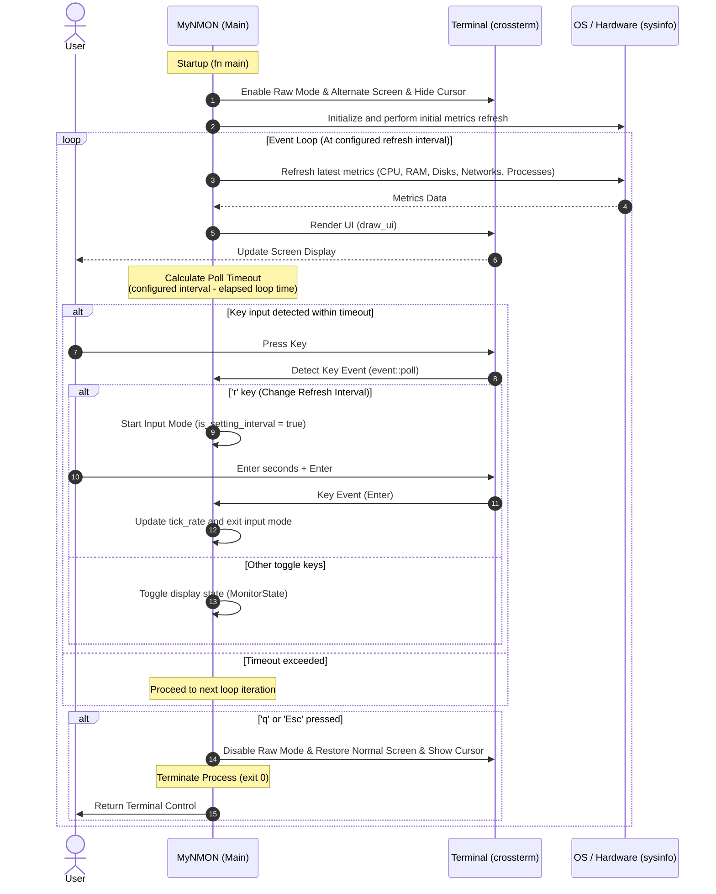

# System Architecture Diagram (DIAGRAM.md)

**English** | [日本語版](../ja/DIAGRAM.md)

This document provides diagrams illustrating the threads, lifecycle, data collection pathways, and event control flow of `MyNMON`.

---

## 1. Application Lifecycle and Event Loop

`MyNMON` achieves low-latency rendering and rapid key event responses within a single thread by combining asynchronous polling from Crossterm with elapsed-time calculation.



---

## 2. Data Flow and Rendering Path

The following diagram illustrates how metrics collected from the OS via `sysinfo` are processed and outputted to the terminal buffer:

```mermaid
graph TD
    subgraph "OS (Kernel Space)"
        ProcFS["Linux /proc"]
        WinAPI["Windows API"]
        macOS["macOS sysctl"]
    end

    subgraph "sysinfo Crate (Data Collection)"
        SysInst["System (CPU, RAM, Processes)"]
        DiskInst["Disks (Mounts, Space)"]
        NetInst["Networks (Rx/Tx bytes)"]
    end

    subgraph "MyNMON Modules"
        State["state::MonitorState (show_cpu, show_mem, etc.)"]
        Draw["ui::draw_ui (UI Rendering Engine)"]
        AscBar["utils::get_ascii_bar (ASCII Bar Engine)"]
    end

    subgraph "crossterm Crate (Rendering)"
        TermBuf["Terminal Alternate Buffer"]
    end

    %% Data Flow Connections
    ProcFS --> SysInst
    WinAPI --> SysInst
    macOS --> SysInst
    ProcFS --> DiskInst
    WinAPI --> DiskInst
    ProcFS --> NetInst
    WinAPI --> NetInst

    SysInst -->|Read Metrics| Draw
    DiskInst -->|Read Disk| Draw
    NetInst -->|Read I/O| Draw
    State -->|Conditional Toggle| Draw
    AscBar -->|Generate [===> ]| Draw

    Draw -->|crossterm::execute!| TermBuf
```
