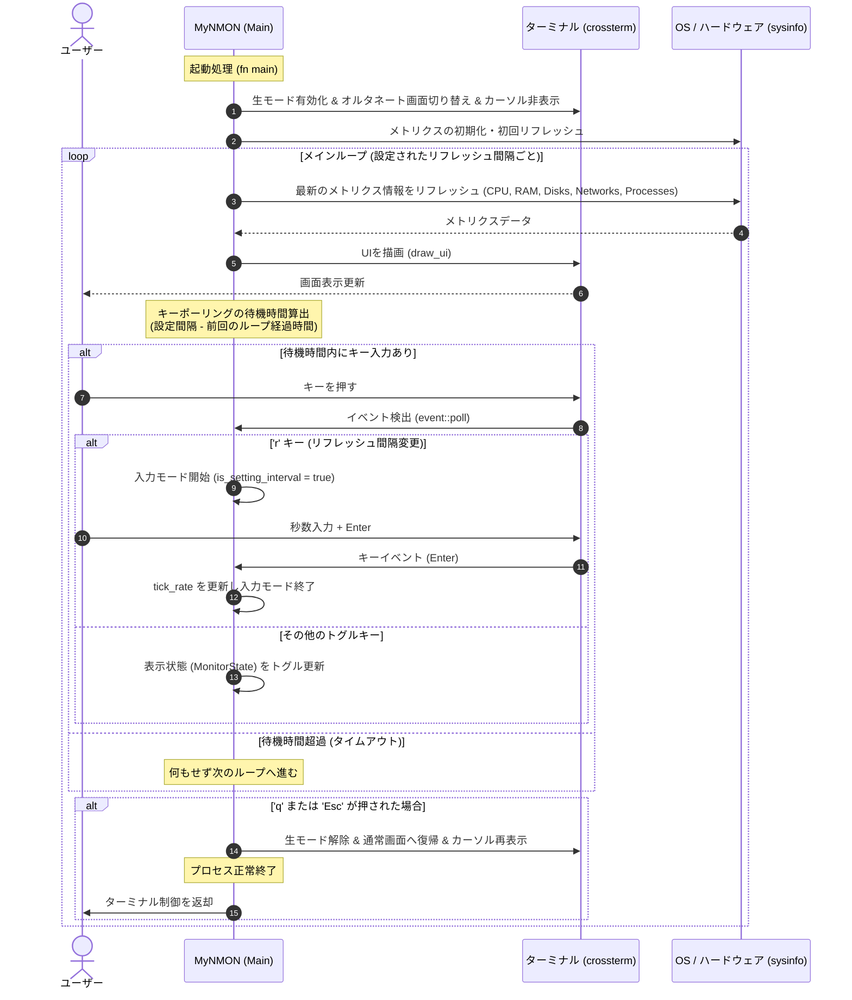

# システム構成図 (DIAGRAM.md)

[English](../en/DIAGRAM.md) | **日本語版**

本ドキュメントは、`MyNMON` のスレッド、ライフサイクル、データ取得経路、およびイベント制御フローをダイアグラムで示したものです。

---

## 1. アプリケーションのライフサイクルとイベントループ

`MyNMON` は、crosstermの非同期ポーリングとタイマー時間算出を組み合わせることで、低レイテンシーな描画とキーイベント応答を単一スレッドで両立しています。



---

## 2. データの取得と描画フロー

`sysinfo` を介してOSから収集したシステムデータが、どのように処理されてターミナルに描画されるかのデータ経路です。

```mermaid
graph TD
    subgraph "OS (Kernel Space)"
        ProcFS["Linux /proc"]
        WinAPI["Windows API"]
        macOS["macOS sysctl"]
    end

    subgraph "sysinfo Crate (Data Collection)"
        SysInst["System (CPU, RAM, Processes)"]
        DiskInst["Disks (Mounts, Space)"]
        NetInst["Networks (Rx/Tx bytes)"]
    end

    subgraph "MyNMON Modules"
        State["state::MonitorState (show_cpu, show_mem, etc.)"]
        Draw["ui::draw_ui (UI Rendering Engine)"]
        AscBar["utils::get_ascii_bar (ASCII Bar Engine)"]
    end

    subgraph "crossterm Crate (Rendering)"
        TermBuf["Terminal Alternate Buffer"]
    end

    %% データフロー接続
    ProcFS --> SysInst
    WinAPI --> SysInst
    macOS --> SysInst
    ProcFS --> DiskInst
    WinAPI --> DiskInst
    ProcFS --> NetInst
    WinAPI --> NetInst

    SysInst -->|Read Metrics| Draw
    DiskInst -->|Read Disk| Draw
    NetInst -->|Read I/O| Draw
    State -->|Conditional Toggle| Draw
    AscBar -->|Generate [===> ]| Draw

    Draw -->|crossterm::execute!| TermBuf
```
